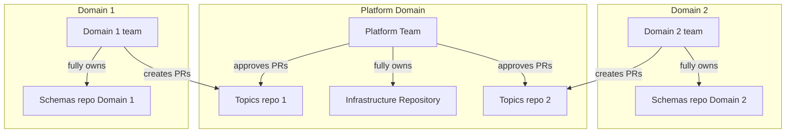

# Confluent cloud - streaming platform - basic
## About this repository

This repository is intended as an example of how an internal streaming platform 
could be build using Confluent Cloud and Terraform. 

It's a POC intended to be as simple as possible while still presenting the [proposed way of working](#proposed-way-of-working) with such platform in a 
multi-team context.

It's not a production ready solution - so that the core presented here can be used and 
integrated with technologies an organization using that has - CI/CD, secret management tools 
and whatever you need.

## Contents of this repository:
- infra terraform module - containing foundations: environment, kafka cluster, service accounts
- topics terraform module
- schema repository
- kafka kotlin client application that publishes and consumes from a created topic

Deeper description on why it's composed that way and the intentions behind this design in [Proposed way of working](#proposed-way-of-working)

## How to use

### Creating the infra & running the app
#### Provisioning the cloud infrastructure
1. Log into Confluent Cloud (https://confluent.cloud/) and generate an API key with scope 
"Cloud resource management". 
2. The terraform code needs access to the key and secret. You can provide it by setting the following
environment variables in the shell where you execute the terraform commands:
   - TF_VAR_confluent_cloud_api_key 
   - TF_VAR_confluent_cloud_api_secret

If you're using linux or mac, you can do that by `export TF_VAR_confluent_cloud_api_key="${your_api_key}"`. 
If you've done that correctly, running `echo $TF_VAR_confluent_cloud_api_key` should output the value of your key

3. `terraform init` in this root folder to initialize terraform
4. `terraform apply` to create all the resources in confluent cloud. Confirm when terraform asks for confirmation.
#### Update the topics ACLs with your service account id
5. After your resources have been created, you need to update your ACL to allow your app-sa Service Account to read and 
write to the topics you've created. Replace the current values in 
[topics.yaml](confluentcloud-streamingplatform-topics/topics.yaml) with the id of your SA. You can display it by 
running `terraform output app-sa-id`.
6. Run `terraform apply` again to update the topics ACLs with your service account id.
#### Installing the schemas in local maven repository
7. To install the schema jar library in your local maven repo that the `clientapp` needs, execute:

`cd ./confluentcloud-streamingplatform-schemas && ./gradlew publishToMavenLocal)`

#### Running the clientapp
8. In the root folder (confluentcloud-streamingplatform-basic) execute `./run-clientapp.sh`. This reads the outputs of
the terraform setup and sets the environment variables in the current shell. After that it navigates to the clientapp 
folder and runs the spring boot application.
In the output you should see logs informing you that you've successfully published and consumed a message.

Now you have deployed everything to the confluent cloud environment and can run your kafka app. To do that follow 
the instructions in [./confluentcloud-streamingplatform-clientapp/readme.md](confluentcloud-streamingplatform-clientapp/readme.md)

### Taking the infrastructure down
If you want to destroy the infrastructure, you need to destroy the modules in the correct order. I wasn't able to 
explicitly mark the dependencies in the terraform code because of ${REASONS}. To take the whole thing down you need to:
1. `terraform destroy -target=module.schemas`
2. `terraform destroy -target=module.topics`
3. `terraform destroy -target=module.infra`

---

## Proposed way of working
This is a POC for an organization with a platform team managing the cluster and multiple domain teams running different 
apps using the kafka cluster to communicate. I'm proposing a divide by domain here so this is a term I'll be using,
but if you're not divided by domain, replace this term with however you want to divide your problem space 
(for example by team, or by product).

More detailed description of the architecture of each component of this setup in the respective readmes. This section 
is primarily about the purpose behind this composition.

---

### Cluster & infrastructure
Developed and governed by the platform team. Changes here affect all teams using the platform. 

---

### Topics
This module controls the topics that are created within the kafka cluster and access to these topics. Proposed approach
is that domains would have independent repositories. 

Changes in the topics are sensitive, so the proposed approach is that PRs are created by the dev teams, but approved by 
the platform team. Also I'd suggest creating a separate service account for this module with permissions to manage
topics and subjects only.

Potentially could be merged with the Schema repository if you choose so.

---

### Schema repository
In this repository schemas are published to the schema registry of the kafka cluster, and the .jar file containing these
schemas is published to a maven repository (in this POC local maven repo.)

This repository is intended to be fully owned by the domain team. Changes to schemas are frequent and with a proper setup
(service account with limited privileges) it's hard to break anything when making a mistake.

As this is a repository defining schemas of a domain, it frequently contains openapi schemas for the REST endpoints,
but it isn't in scope of this POC.

---

## What's missing from production-ready setup

- CICD integration (including remote terraform state) & secret management is not present 
- Environment management is not present
- More service accounts with limited privilegeswould be strongly advised so that the domian teams CICD isn't using a 
SA with permissions to destroy planets
- Schema management approach with jar & artifactory works for JVM applications, but if you're working in a different 
ecosystem - you'll need to think how you want to provision the schemas to your workloads. I've seen a setup where the build
system is checking out the git repository and pulling schemas this way
- Kafka cluster is basic, because it doesn't generate any costs when idle - so perfect for learning and development.
    It's not intended for production use.
- ACL can be replaced with RBAC (https://docs.confluent.io/cloud/current/security/access-control/rbac/overview.html)
  that's simpler, but full RBAC support is not present in basic cluster so I wasn't able to use that
- add the `lifecycle { prevent_destroy = true }` to the resources you want to protect (so that you don't delete 
clusters or topic by accident)
- validation of the .yaml interfaces

## Contact us
If you'd like to report issues with this repository or talk about the services we provide, contact us at 
[contact@kentra.io](mailto:contact@kentra.io)
